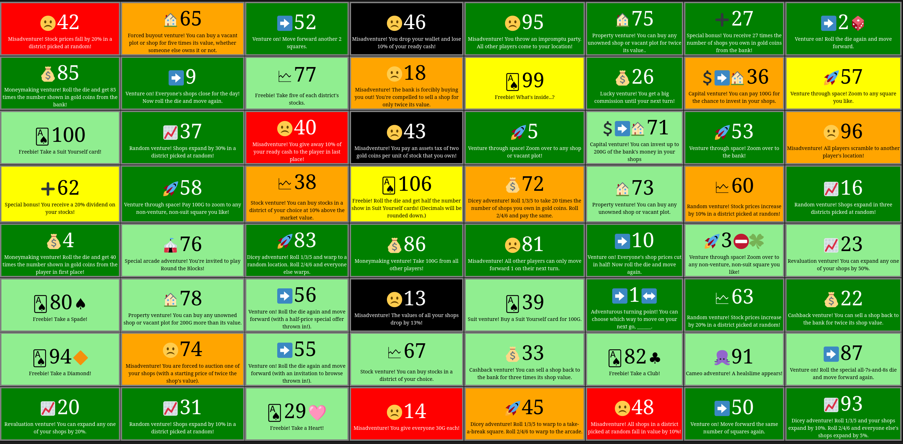

# Boom Street venture cards table generator

Do you play [Boom Street](https://en.wikipedia.org/wiki/Itadaki_Street), also known as Fortune Street, Itadaki Street or Course À La Fortune ?

If so, you likely noticed venture cards play an important role in the game.
This repository provides a single, simple Python script that turns a text-based description of an 8x8 venture card board into an HTML page that describes each available card.

## How to?

### Step 0: install Python

This step is typically for Windows users as Linux/MacOS/BSD users typically
benefit from Python out of the box.

1. Download and install [Python](https://www.python.org/downloads/)
2. Learn [how to run a Python script](https://docs.python.org/3/faq/windows.html#how-do-i-run-a-python-program-under-windows)

### Step 1: describe a venture card board

Using your favorite [plain text editor](https://en.wikipedia.org/wiki/Text_editor),
describe any venture card board by writing 8 lines of 8 space-separated numbers:

```
 42 65 52  46 95 75 27  2
 85  9 77  18 99 26 36 57
100 37 40  43  5 71 53 96
 62 58 38 106 72 73 60 16
  4 76 83  86 81 10  3 23
 80 78 56  13 39  1 63 22
 94 74 55  67 33 82 91 87
 20 31 29  14 45 48 50 93
Anything after line #8 is ignored.
Feel free to store comments or other data here.
```

In this example, we assume the board above is saved as "example.txt".

### Step 2: generate the HTML page

```shell
./generate.py < example.txt > example.html
```

### Step 3: open the HTML page

Using your favorite browser (e.g. Firefox or Chrome), open the resulting file (here, `example.html`).



## Acknowledgments

Venture card data are taken from [Rolan](https://gamefaqs.gamespot.com/community/Paladin_Rolan)'s [Venture Card List](https://gamefaqs.gamespot.com/wii/632973-fortune-street/faqs/70142).
We hereby reproduce its "legal info" section:
```
///////////////////////
//6. Legal Info [LGL]//
///////////////////////

For this guide, I'm submitting it (and updates) to
www.gamefaqs.com first but will allow other sites to use it,
PROVIDED they credit me with its creation, of course.

Its STEALING and just plain wrong if you use it on your site 
claiming it as your own.

Copyright 2014 Rolan
```

Note: for technical reasons, Rolan's original file was simplified and reformatted.

Like Rolan, we also credit Square Enix and Nintendo, for making a fun game.
